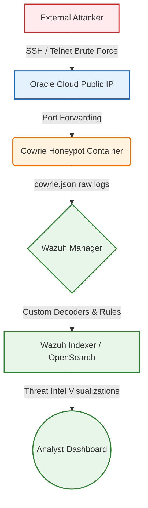
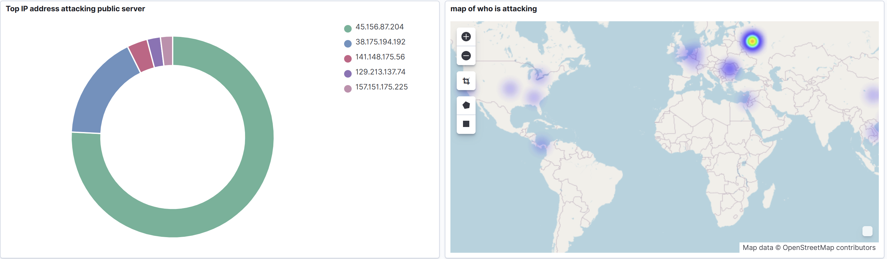
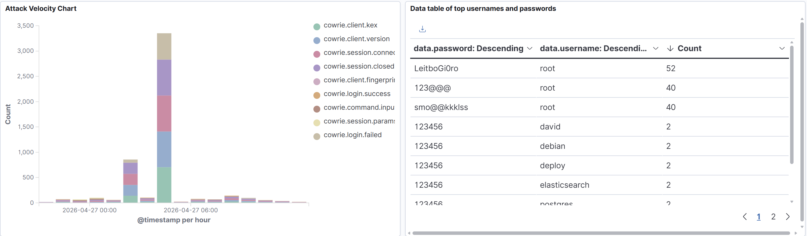
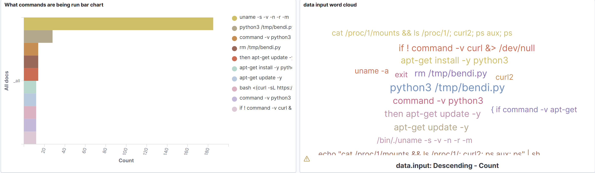

# Honeypot Threat Intelligence & SIEM Pipeline

## Architecture Overview

The following diagram illustrates the flow of traffic from external attackers into the honeypot environment, and how that telemetry is forwarded to the SIEM for analysis.



## Threat Intelligence Findings (12-Hour Capture)

*(Note: The following data was captured over a 12-hour window using a flat honeypot infrastructure exposing SSH/Telnet via Cowrie, feeding directly into a Wazuh SIEM with custom rules.)*

### 1. The Threat Landscape (Origins & Credential Stuffing)

Automated scanners begin mapping and attacking exposed IPv4 ports within minutes of deployment. The attacks are highly distributed, with significant hotspots originating from global botnet infrastructures.

 
*Visualizing the geographic distribution of attacking IP addresses and the top offending nodes.*

The initial breach vector relies heavily on brute-forcing default or weak credentials. The data shows a massive preference for targeting the `root` user, confirming that attackers are hunting for high-privileged access immediately.


*Top Username/Password combinations attempted, demonstrating reliance on default IoT credentials and weak numeric strings (e.g., `123@@@`, `123456`).*

### 2. Post-Exploitation Tactics (MITRE ATT&CK)

Once access is gained, bots immediately execute automated scripting to footprint the environment and establish persistence. 


*Bar chart and word cloud of executed commands showing a heavy reliance on automated reconnaissance (`uname -a`, `nproc`) and payload retrieval.*

**Case Study: The "RedTail" Botnet Sequence**
During the capture window, the honeypot intercepted a textbook automated botnet attack sequence—highly characteristic of the "RedTail" botnet (Trojan.Alevaul), often associated with cryptocurrency mining or DDoS capabilities. The entire attack took exactly **21.3 seconds**.

* **Phase 1: Initial Breach (T1110):** The attacker (`130.12.180.51`) connected via SSH-2.0-Go. The bot successfully brute-forced the `root` account in under a second.
* **Phase 2: Persistence and Evasion (T1070 & T1098.004):** The bot executed a chained bash command to manipulate the `~/.ssh/authorized_keys` file. Crucially, it used `chattr -ia` to unlock the file, injected its own RSA key (`rsa-key-20230629`), and then used `chattr +ai` to lock the file down, ensuring persistence even if the root password was changed.
* **Phase 3: Payload Delivery (T1105):** The bot uploaded a staging script (`setup.sh`) and four different versions of its primary payload (`redtail.arm7`, `redtail.arm8`, `redtail.i686`, `redtail.x86_64`). This is a standard "spray" tactic for IoT/Linux botnets to ensure execution regardless of the host's CPU architecture.
* **Phase 4: C2 Beacon:** The bot echoed `\x61\x75\x74\x68\x5F\x6F\x6B\x0A` (ASCII: `auth_ok\n`) to signal a successful compromise to its Command & Control server.

### 3. Payload Delivery & Malware Analysis

The captured `setup.sh` script functions as an architecture-aware loader. It searches the filesystem for a writable/executable directory, identifies the system architecture via `uname`, and executes the correct `redtail.*` binary before cleaning up its tracks by deleting the dropped files.

**VirusTotal Analysis:**
Static analysis and cross-referencing of the dropped staging script (`setup.sh`) confirms its identity.
* **Threat Category:** Trojan (Trojan.Alevaul / Trojan.Linux.Coinminer)
* **Detection:** Flagged by 20+ security vendors. 

**Extracted Indicators of Compromise (IOCs):**
* **Source IP:** `130.12.180.51`
* **SSH Hassh Fingerprint:** `5f904648ee8964bef0e8834012e26003` (Highly valuable for tracking this specific Go-based botnet client)
* **Malware SHA-256 (`redtail.x86_64`):** `59c29436755b0778e968d49feeae20ed65f5fa5e35f9f7965b8ed93420db91e5`
* **Malware SHA-256 (`setup.sh`):** `783adb7ad6b16fe9818f3e6d48b937c3ca1994ef24e50865282eeedeab7e0d59`
* **Injected SSH Key:** `rsa-key-20230629`

## Deployment Instructions (Reproducibility)

To deploy this flat honeypot infrastructure on your own host (such as an Oracle Cloud instance), follow these steps:

### Prerequisites
* **Docker and Docker Compose** installed on your host system.
* **Port 2222** open on your host's firewall to allow inbound honeypot traffic.

---

### Deployment Steps

1. **Clone this repository to your host:**
   ```bash
   git clone [https://github.com/coltonhatfield/oracle-wazuh-honeypot.git](https://github.com/coltonhatfield/oracle-wazuh-honeypot.git)
   cd oracle-wazuh-honeypot
2. **Deploy the infrastructure in detached mode. Note: The -d flag must come after up:**
   ```bash
   docker compose up -d
3. **Verify the container is running:**
   ```bash
   docker compose ps
4. **Wazuh Integration:**
   Deploy the custom decoders and rules found in the rules/local_rules.xml directory directly into your Wazuh Manager's configuration.


## Conclusion & Learnings

* **Security by obscurity is dead:** Automated scanners map and attack exposed IPv4 ports within minutes of deployment. You cannot hide on the internet.
* **Infrastructure as Code (IaC):** Containerizing the sensor array allows for the rapid, disposable deployment of high-fidelity threat intelligence gathering nodes. 
* **Actionable SIEM Engineering:** Collecting raw logs is insufficient. Building custom decoders in Wazuh to extract specific fields (like `data.shasum` and `data.input`) was critical in turning raw, noisy SSH logs into structured, chronological attack narratives.
